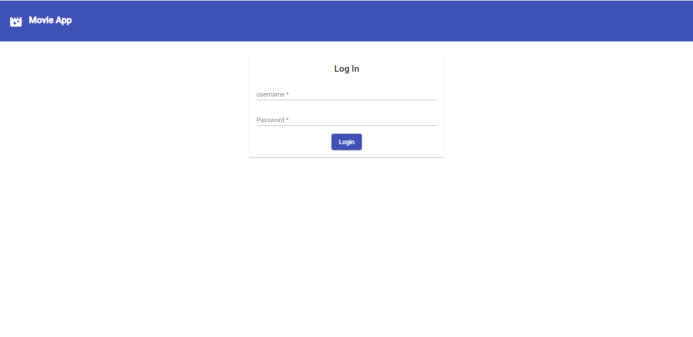
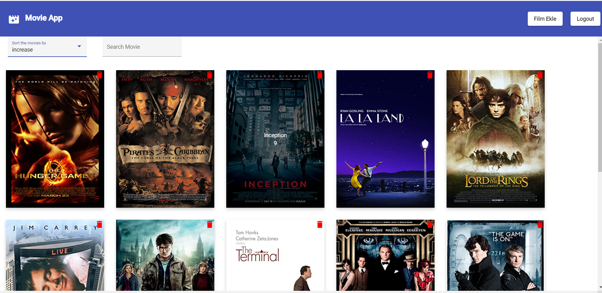
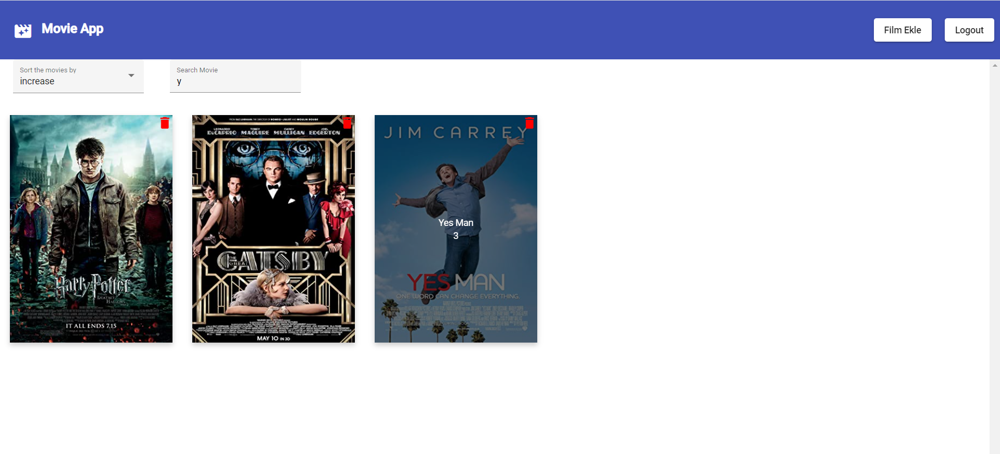
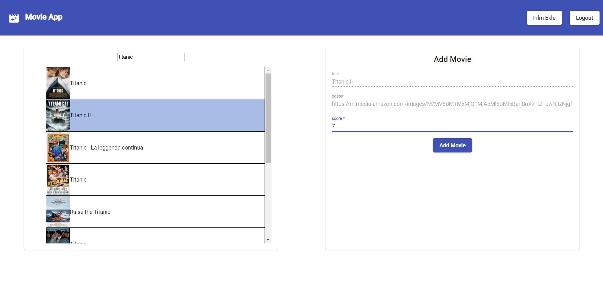
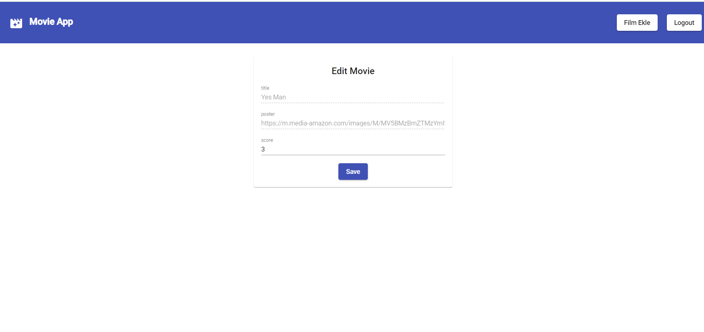

# Movie App
This app provides to manage list of your movies that you select, you can add new movie from omdb, delete or update the movie by using this app.

## Setup Guide
Node version = v14.17.0
Npm version = 6.14.13

```sh
cd movie-client
npm i
```

> Note: This app using omdb api so firstly you should add omdb api key yo config file (config.ts) in the project

```sh
imdbApiKey: 'please enter omdb api key'
```

For run the rest api
```sh
cd movie-client
npm run db
```

For start to app
```sh
cd movie-client
npm run start
```

# Features
Login



Movie List






Add Movie



Edit Movie


